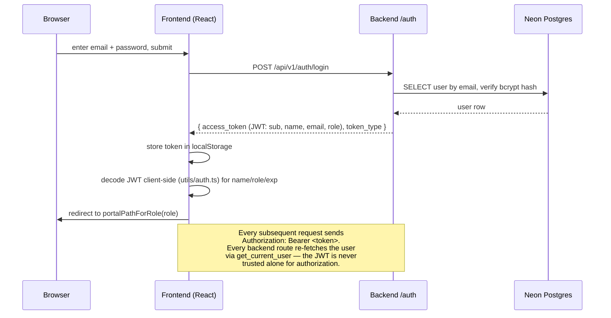
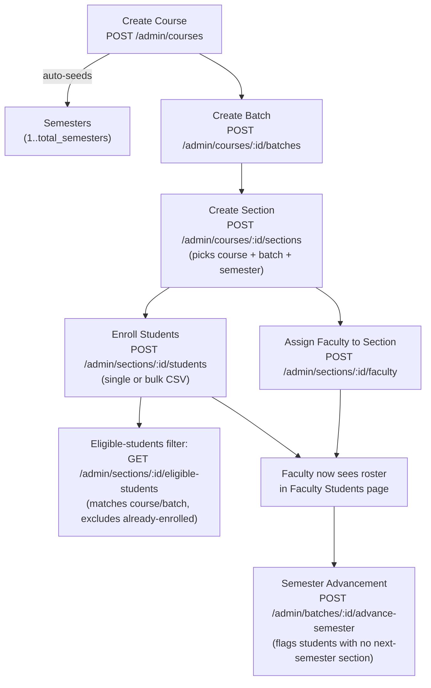
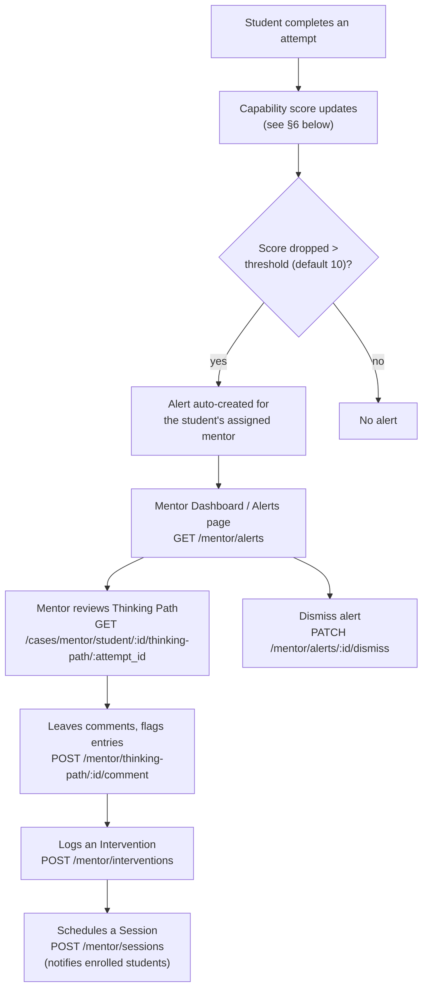
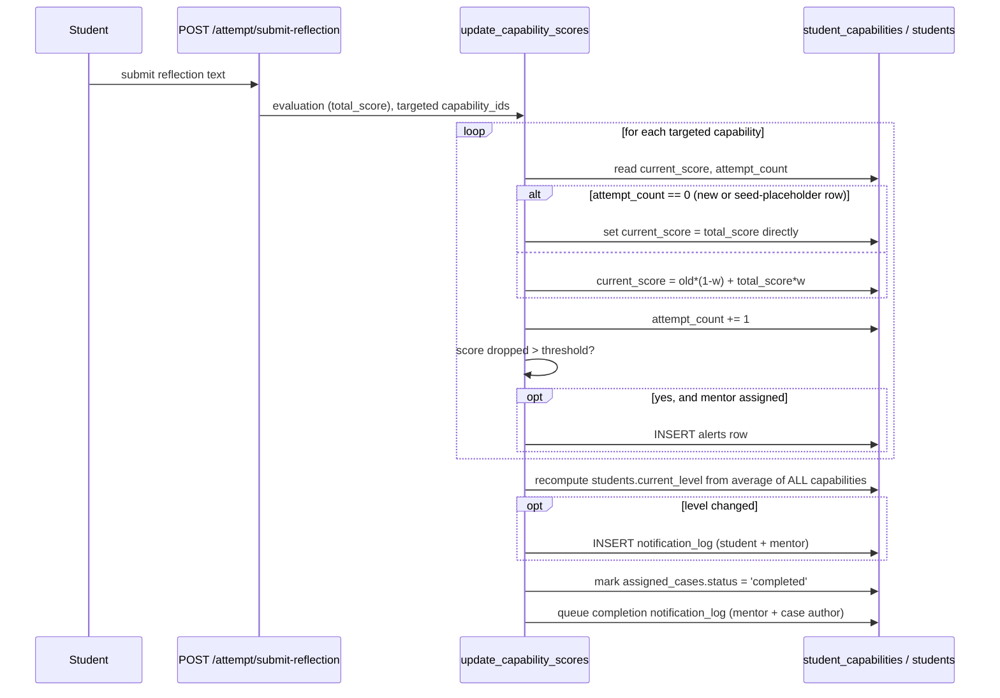

# PCDC — Project / User Flows

End-to-end journeys through the system, tying together the pieces
described separately in `FEATURES.md` (what exists) and `TECH_SPECS.md`
(exact endpoints/schema). Diagrams are mermaid — GitHub and most Markdown
viewers render them inline.

---

## 1. Authentication Flow

`ProtectedRoute` (frontend) checks `isAuthenticated()` (token present +
not expired) and, if the route declares `allowedRole`, checks the
decoded role matches — redirecting to `/login` or `/unauthorized`
otherwise. This is a UX convenience only; the real access control is the
`require_role(...)` check inside each backend service function.

---

## 2. Student Case Attempt Journey (the core product flow)

```mermaid
flowchart TD
    A["My Case Studies list<br/>/student/case-studies"] -->|click available case| B["Case Detail<br/>GET /cases/:id/detail"]
    B -->|"Start Attempt"| C["POST /cases/attempt/start<br/>(403 if not assigned, 409 if already attempted)"]
    C --> D["Attempt flow: Stage 1 Briefing<br/>(case content, no API call)"]
    D --> E["Stage 2: Initial Analysis<br/>≥200 words required"]
    E -->|"POST /attempt/submit-analysis"| F["Opening AI message generated<br/>+ stored, status → ai_discussion"]
    F --> G["Stage 3: AI Discussion<br/>POST /attempt/ai-message (repeatable)"]
    G -->|"ready to submit solution"| H["Stage 4: Solution form<br/>(4 fields, client-side only)"]
    H -->|"POST /attempt/submit-solution"| I["3 AI defense questions generated<br/>status → solution_submitted"]
    I --> J["Stage 5: Defense<br/>answer all 3 questions"]
    J -->|"POST /attempt/submit-defense"| K["Evaluation generated (not yet shown)<br/>status → defense_complete"]
    K --> L["Stage 6a: Reflection prompt<br/>(new step added in SPEC_20)"]
    L -->|"POST /attempt/submit-reflection"| M["Capability scores updated,<br/>assigned_cases marked completed,<br/>notifications queued,<br/>status → evaluated"]
    M --> N["Stage 6b: Evaluation results shown<br/>(score, grade label, strengths/weaknesses)"]
```

Key properties of this flow:
- **Resumable from any stage.** Reloading the attempt page re-fetches the
  case detail + full attempt record and reconstructs local state
  (analysis text, chat history, defense questions, evaluation) from the
  database — nothing beyond the current in-progress screen's unsaved
  keystrokes is ever lost to a refresh.
- **One attempt per case, enforced at the DB level** (unique constraint),
  not just a UI restriction — a second `POST /attempt/start` for the same
  case returns 409.
- **The Case Detail page doubles as the results viewer.** "View My
  Results" for a completed case routes back into the same attempt page,
  which renders stage 6's evaluation display directly instead of a
  separate results page.

---

## 3. Faculty: Author → Publish → Assign

```mermaid
flowchart LR
    A["Case Builder: new draft<br/>POST /faculty/cases"] --> B["Fill 9-section content<br/>+ capability/career tags<br/>+ timing & marks"]
    B --> C{"Generate with AI?"}
    C -->|yes| D["POST /cases/:id/generate<br/>(async job, OpenAI structured output)"]
    C -->|no, manual| E["Manual save<br/>PUT /faculty/cases/:id"]
    D --> E
    E --> F["Structured Written Questions<br/>+ Rapid Fire Questions<br/>(manual or AI-generated)"]
    F --> G["Publish-gate validation<br/>POST /faculty/cases/:id/publish"]
    G --> H["status: published"]
    H --> I["Assign to Class<br/>POST /faculty/cases/:id/assign-section"]
    I --> J["Bulk-creates assigned_cases rows<br/>for every enrolled student<br/>+ notification_log entries"]
    J --> K["Students see the case in<br/>My Case Studies"]
```

Faculty can also track completion after assigning: **Case Library →
Class Assignments** shows a live completion-rate bar per assignment
(`GET /faculty/cases/assigned`), with a **Close** action
(`PATCH /faculty/case-assignments/:id/close`).

---

## 4. Admin: Academic Structure Onboarding

Section management can also happen inline from the Courses page, or from
the dedicated cross-course **Sections** page (which additionally flags
any section with no assigned faculty).

---

## 5. Mentor: Monitoring & Intervention

---

## 6. Capability Scoring Update (triggered by every completed attempt)

This is the single mechanism feeding: the student dashboard's Capability
Matrix and hero message, the mentor roster's capability trends, the
level/level-label shown in the header, and score-drop alerts. There is no
separate "recompute on dashboard load" path — the dashboard only ever
reads what this flow already wrote (see `TECH_SPECS.md §4.2`).

---

## 7. Where the Static/Mock Pages Fit

Several student-facing pages (`AI Coach`, `Achievements`, `Career
Pathway`, `Mentor Support`, `Capability Profile`) are visually complete
but not wired into any of the flows above — they render fixed data
regardless of what the student actually does. If/when these are made
real, the natural integration points already exist:
- **Capability Profile** → `capability_engine.get_capability_matrix` (§6)
  already computes the exact numbers this page would need.
- **Mentor Support** → the real mentor assignment (`students.mentor_id`)
  and `sessions`/`session_students` tables already back the Mentor
  portal's real Sessions feature — this page just doesn't call it yet.
- **AI Coach** → would be a new, separate OpenAI integration point (there
  is no existing "general coaching chat" endpoint to reuse — it would be
  net-new, unlike the other three which have real backing data waiting).
