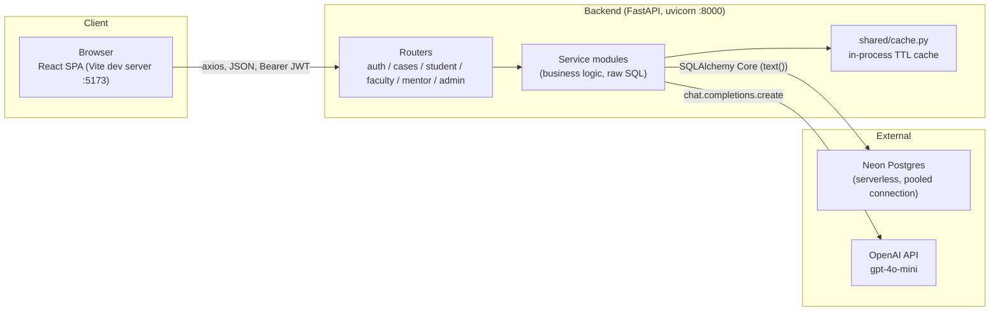

# PCDC — Technical Architecture

This document describes the system **as it actually exists in the codebase
today**, not the original aspirational design (see the note at the bottom
on drift from `context/project-overview.md`).

---

## 1. System Overview



- **Frontend**: React 19 + TypeScript, built/served by Vite, styled with
  Tailwind CSS, routed with React Router.
- **Backend**: Python + FastAPI, single process, routers mounted under
  `/api/v1`, talking to Postgres via raw SQL (SQLAlchemy Core, not the ORM)
  and to OpenAI for the two AI-driven features.
- **Database**: PostgreSQL hosted on [Neon](https://neon.tech) (serverless,
  autosuspending compute, connected through Neon's pooler endpoint).
- **No separate cache/queue/CDN layer.** Everything runs as two local dev
  processes talking to one hosted Postgres instance — there is currently no
  staging/production deployment distinct from this local setup.

---

## 2. Backend Architecture

### 2.1 Process & entrypoint

`backend/main.py` creates a single `FastAPI()` app, adds one CORS
middleware, and mounts 9 routers. Run via:

```
.venv/Scripts/python.exe -m uvicorn main:app --reload --host 0.0.0.0 --port 8000
```

`--host 0.0.0.0` so the API is reachable from other devices on the LAN (see
`context/current-feature.md`'s 2026-07-07 network-access-fix history for
why); `--reload` restarts the worker process on `.py` file changes only —
**it does not reload on `.env` changes**, so editing `.env` requires a
manual restart.

### 2.2 Router / service module pattern

Every feature area is a folder under `backend/services/<name>/` with up to
four files:

| File | Responsibility |
|---|---|
| `router.py` | FastAPI route declarations only — thin wrappers that call into `service.py` and translate exceptions to HTTP responses |
| `service.py` | All business logic and every SQL statement (raw `text()` queries) |
| `models.py` | Pydantic request/response schemas (not all endpoints use one — several just return `Dict[str, Any]`) |
| `__init__.py` | empty, package marker |

Real, actively-used service modules and their mount points (all under
`/api/v1` except where noted):

| Module | Mounted at | Purpose |
|---|---|---|
| `auth` | `/api/v1/auth` | register, login, JWT issuance, `get_current_user` dependency used everywhere else |
| `simulation` | `/api/v1/cases` | **Confusingly named** — this is the real Case Studies module: case CRUD, publish/archive, the 6-stage attempt flow, capability score updates, mentor thinking-path views |
| `student` | `/api/v1/student` | student-facing dashboard/profile/capability-matrix endpoints, capability aggregation |
| `faculty` | `/api/v1/faculty` | Case Builder (AI-assisted authoring), rubric builder, section assignment, faculty analytics |
| `mentor` | `/api/v1/mentor` | mentor roster, sessions, interventions, alerts, thinking-path comments |
| `admin` | `/api/v1/admin` | user management, CSV import, courses/batches/sections, semester advancement |

Three more modules exist but are **dead stubs** — each is just a single
`GET /health` route with no real logic, left over from the initial
scaffold and never built out:

| Module | Mounted at |
|---|---|
| `capability` | `/capability` (not even under `/api/v1`) |
| `ai` | `/ai` |
| `notification` | `/notification` |

Don't be misled by these names — the real capability-scoring logic lives
in `services/student/capability_engine.py` (read path) and
`services/simulation/service.py` (write path, see §5), and the real AI
calls live directly in `services/simulation/service.py` and
`services/faculty/router.py`. There is no `director` service module at
all — the Director role exists in the DB/auth layer but has no backend
built for it yet (frontend is a placeholder, see `FEATURES.md`).

### 2.3 Database access — no ORM models, raw SQL only

`backend/shared/database.py` creates one SQLAlchemy `engine` from
`DATABASE_URL` and exposes `SessionLocal` / `get_db()` (a FastAPI
dependency). There are **no SQLAlchemy declarative models** anywhere in
the codebase — every query is a raw `text("""SELECT ...""")` string
against `db.execute(...)`, and results are consumed via `row.column_name`
or `row._mapping`. This is a deliberate, consistent convention across all
6 real service modules — new code should follow it rather than introducing
ORM model classes.

Schema changes go through Alembic (`backend/alembic/versions/`, 11
migrations as of this writing) — see `TECH_SPECS.md` for the full schema
and migration history. **Never hand-edit the database schema directly.**

### 2.4 Caching

`backend/shared/cache.py` provides a simple in-process TTL cache
(`cache_get`/`cache_set`) used to memoize a few expensive dashboard
aggregation queries (e.g. `student_dashboard_summary`,
`faculty_dashboard_summary`). It is per-process, in-memory — restarting
the backend clears it, and it does not coordinate across multiple worker
processes (there is only ever one worker in this setup, so that's fine
today, but it would need to become a real cache like Redis before running
multiple backend instances).

### 2.5 Auth

- JWT (HS256), issued by `services/auth/service.py::create_access_token`,
  read via `SECRET_KEY`/`ALGORITHM`/`ACCESS_TOKEN_EXPIRE_MINUTES` env vars.
- Payload carries `sub` (user id), `name`, `email`, `role`.
- `get_current_user` (a FastAPI dependency, imported into every other
  router) decodes the token and re-fetches the user row from `users` on
  every request — it does not trust stale claims for authorization
  decisions beyond identity.
- Role-based access control is done ad hoc per endpoint via a
  `require_role(current_user, [...], message)` helper repeated in each
  service module (not a shared decorator) — check the specific
  `service.py` for the exact allowed roles on any given endpoint.
- The frontend decodes the JWT client-side (`utils/auth.ts`) purely to
  read `name`/`role`/`exp` for UI purposes (header identity, route
  guarding) — it is never treated as a trust boundary; every real
  authorization check happens server-side per request.

### 2.6 CORS

A single `allow_origin_regex` (`main.py`) matches `localhost` or any bare
IPv4 address on port 5173 — this lets the Vite dev server be reached from
any device on the LAN (by IP) or from `localhost`, without opening the API
to arbitrary origins. See `context/current-feature.md`'s 2026-07-07
network-access-fix entry for the two prior CORS bugs this regex was tuned
to avoid (over-broad `[\w.\-]+` letting `evil.com` through; too-narrow
private-IP-only regex excluding the public IP).

### 2.7 AI integration

Two independent AI integration points, **both using OpenAI's
`chat.completions.create` with `gpt-4o-mini`** (as of the most recent
session — this was migrated off Anthropic's Claude SDK; see
`context/current-feature.md`'s history for why):

1. **Faculty Case Builder generation** (`services/faculty/router.py`):
   full-case generation, structured-question generation, rapid-fire
   question generation. Uses OpenAI's `response_format: json_schema` mode
   for strict structured output.
2. **Student case-attempt flow** (`services/simulation/service.py`,
   `call_llm()`): opening AI discussion message, AI chat replies, defense
   question generation, final evaluation scoring. Uses free-form JSON in
   the prompt text + best-effort `json.loads` parsing (not the strict
   schema mode faculty generation uses).

Both read `OPENAI_API_KEY` from `.env`; model name is overridable per call
site via env vars (`OPENAI_CASE_GENERATION_MODEL`, `OPENAI_MODEL`), both
defaulting to `gpt-4o-mini`.

---

## 3. Frontend Architecture

### 3.1 Stack

React (TypeScript) + Vite + Tailwind CSS + React Router + Axios + Lucide
icons + Recharts (for the few chart views). No server-side rendering — a
pure client-rendered SPA.

### 3.2 Routing

`frontend/src/App.tsx` declares top-level routes, gated by
`<ProtectedRoute allowedRole="...">`. Each portal (student/faculty/mentor/
admin/director) beyond the student routes is mounted as a `/*` wildcard
pointing at a `<XPortal />` component that declares its own nested
`<Routes>` — so faculty/mentor/admin/director routing is two-level
(`App.tsx` → `XPortal.tsx` → page).

### 3.3 API client layer

`frontend/src/api/*.ts` — one file per domain (`auth.ts`, `student.ts`,
`cases.ts`, `faculty.ts`, `admin.ts`, `mentor.ts`), each wrapping a shared
`axios` instance (`api/axios.ts`) with typed request/response interfaces
and thin async functions. Pages call these functions directly in
`useEffect`; there is no separate data-fetching/caching library (no
React Query, no SWR) — each page manages its own `useState`/`useEffect`
loading/error state.

`api/axios.ts`'s `baseURL` defaults to
`` `${window.location.protocol}//${window.location.hostname}:8000/api/v1` ``
— it always calls back to whatever host served the page, so the same
build works from `localhost`, a LAN IP, or a public IP without
rebuilding. `VITE_API_URL` overrides it if ever needed.

### 3.4 Layouts

`frontend/src/layouts/DashboardLayout.tsx` is the shared shell for every
student page (sidebar nav, header with avatar dropdown). Faculty/mentor/
admin each have their own portal-specific layout component alongside
their `XPortal.tsx`.

### 3.5 Auth context

`utils/auth.ts` handles JWT storage (`localStorage`) and decoding.
`context/AuthContext.tsx` wraps the app; `components/auth/ProtectedRoute.tsx`
redirects to `/login` if unauthenticated or to `/unauthorized` if the
role doesn't match the route.

---

## 4. Cross-Cutting Conventions Worth Knowing

- **Two schema-naming layers that don't match.** Several feature specs in
  `context/features/` were written against an *illustrative* schema
  (`simulations`, `simulation_attempts`, `OPENAI_API_KEY` used
  interchangeably with what the code actually reads) that differs from
  the real tables/env vars the code uses. When implementing a spec,
  verify against the real schema (`TECH_SPECS.md` or a live
  `information_schema.columns` query) rather than trusting a spec's SQL
  snippets literally.
- **Legacy dead tables**: `simulations` and `simulation_attempts` (from
  the original migration 0001 baseline) are not read or written by any
  current application code — the real case-study attempt flow uses
  `case_studies` / `case_study_attempts` instead. Don't confuse the two
  when reading migrations.
- **One attempt per student per case**, enforced at the DB level via a
  unique constraint on `(case_study_id, student_id)` in
  `case_study_attempts` — not just a UI restriction.
- **No automated test suite.** Verification throughout this project's
  history has been manual: `python -m py_compile` for backend syntax,
  `tsc -b && vite build` for frontend type/build correctness, and direct
  `SessionLocal()` scripts or live HTTP calls against the dev DB for
  behavioral verification. If you add tests, there is no existing
  framework/convention to match — pick one and document it here.

---

## 5. Capability Scoring Engine (architecture note)

Score **writes** happen in `services/simulation/service.py`
(`update_capability_scores` → `update_single_capability_score`), triggered
inside the attempt-completion transaction (`submit_reflection`). Score
**reads/aggregation** for the student dashboard happen in a separate,
read-only module, `services/student/capability_engine.py` — deliberately
kept as a second module rather than folded into the writer, so the
dashboard's 4-category view can be reshaped without risking the scoring
algorithm itself. See `TECH_SPECS.md §4` for the full algorithm.

---

## 6. Known Architectural Debt

- 3 dead stub service modules (`capability`, `ai`, `notification`) mounted
  in `main.py` alongside the 6 real ones — candidates for removal once
  confirmed nothing depends on their `/health` routes.
- `simulation` is the wrong name for what is now entirely the Case Studies
  module — renaming would be a larger, riskier refactor (touches every
  import across 6+ files) and hasn't been done.
- No automated tests, no CI pipeline, no staging environment.
- No structured logging — the only visibility into backend errors today
  is `print()` statements in router exception handlers and whatever
  uvicorn writes to stdout.
